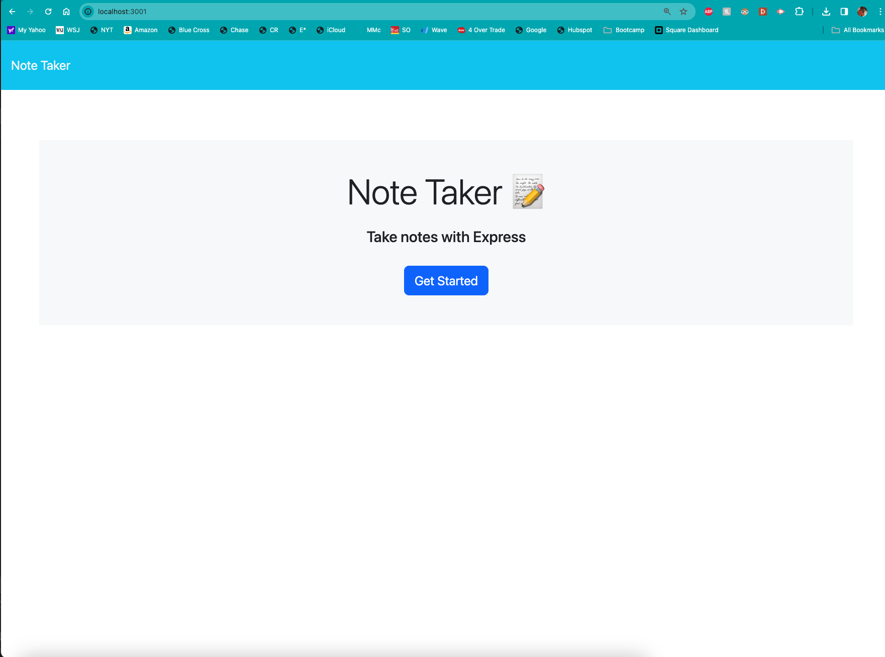
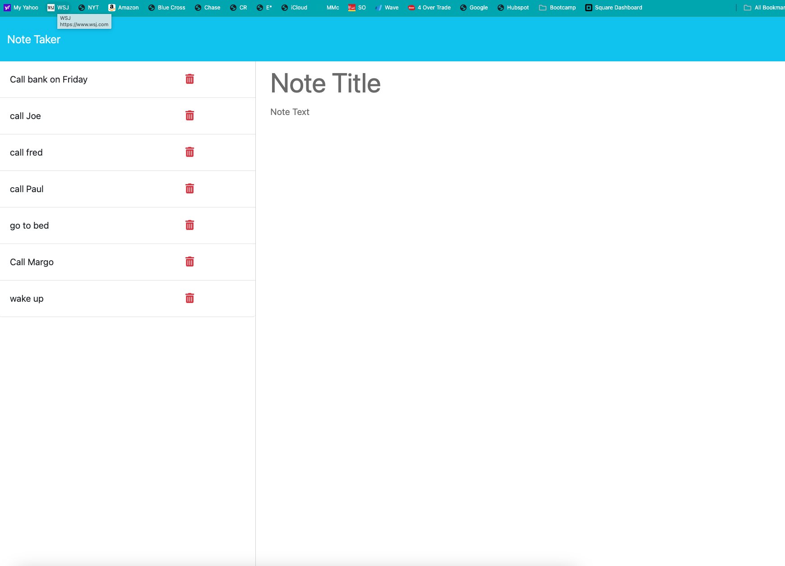

# Express.js: Note Taker

## Description

The application is called Note Taker and can be used to write and save notes. This application uses an Express.js back end and saves and retrieves data from a db.json file.

## Visuals

## Installation
None

## Usage
Existing notes are listed in the left-hand column with empty fields on the right-hand side for the new note’s title and text.  Enter your title, tab down to the notes and then click save in the upper right.  You can review any of the notes on the left side by clicking on them.  Deletion is now supported.  Click on the trash can to remove a note. 

## Support
Please reach out to me with any questions - matt@mmcprintpackaging.com

## Contributing
Open to suggestions.

## Authors & Acknowledgement
Myself and UCLA tutors and Bootcamp lessons

## License
N/A

## Project Status
Ongoing and will be updated with new/relavent info as needed.
